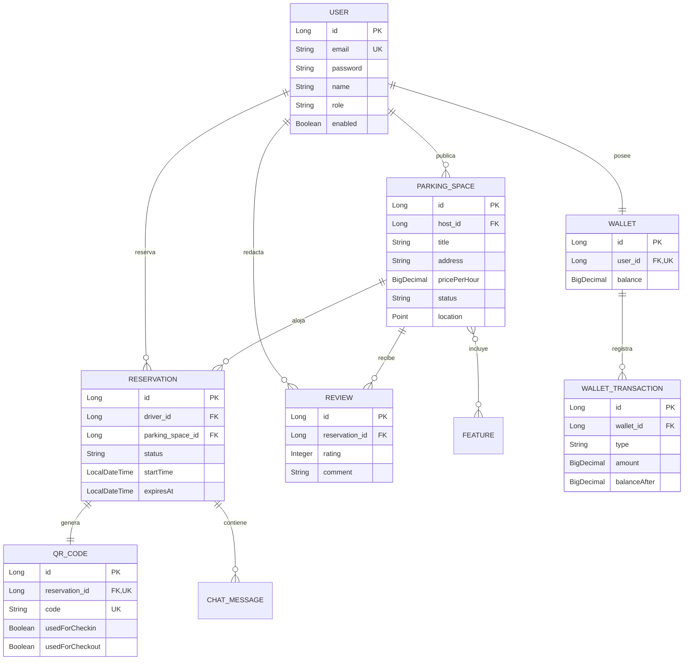

# CocheraYa — Plataforma Backend Inteligente de Estacionamiento On-Demand

---

## 1. Portada

* **Título del Proyecto:** CocheraYa — Marketplace Inteligente y Colaborativo de Estacionamiento On-Demand en Lima Metropolitana
* **Curso:** CS 2031 Desarrollo Basado en Plataforma
* **Periodo:** 2026-2
* **Institución:** Universidad de Ingeniería y Tecnología (UTEC) — Lima, Perú
* **Integrante:** 
  * Christian Mar Carrillo (christian.mar@utec.edu.pe)
  * Luciano Rivera Valentin (luciano.rivera@utec.edu.pe)
  * Anthony Caypane Ramirez (anthony.caypane@utec.edu.pe)

---

## 2. Índice

1. [Portada](#1-portada)
2. [Índice](#2-índice)
3. [Introducción](#3-introducción)
   * [Contexto](#contexto)
   * [Objetivos del Proyecto](#objetivos-del-proyecto)
4. [Identificación del Problema o Necesidad](#4-identificación-del-problema-o-necesidad)
   * [Descripción del Problema](#descripción-del-problema)
   * [Justificación](#justificación)
5. [Descripción de la Solución](#5-descripción-de-la-solución)
   * [Funcionalidades Implementadas](#funcionalidades-implementadas)
   * [Tecnologías Utilizadas](#tecnologías-utilizadas)
6. [Modelo de Entidades](#6-modelo-de-entidades)
   * [Diagrama de Entidades](#diagrama-de-entidades)
   * [Descripción de Entidades y Relaciones](#descripción-de-entidades-y-relaciones)
7. [Manejo de Errores](#7-manejo-de-errores)
   * [Excepciones Globales y Códigos de Estado](#excepciones-globales-y-códigos-de-estado)
8. [Medidas de Seguridad Implementadas](#8-medidas-de-seguridad-implementadas)
   * [Seguridad de Datos](#seguridad-de-datos)
   * [Prevención de Vulnerabilidades](#prevención-de-vulnerabilidades)
9. [Eventos y Asincronía](#9-eventos-y-asincronía)
   * [Eventos del Sistema](#eventos-del-sistema)
   * [Importancia y Justificación Asíncrona](#importancia-y-justificación-asíncrona)
10. [GitHub & Management](#10-github--management)
    * [Gestión de Tareas y GitHub Projects](#gestión-de-tareas-y-github-projects)
    * [Pipeline de CI/CD con GitHub Actions](#pipeline-de-cicd-con-github-actions)
11. [Conclusión](#11-conclusión)
    * [Logros del Proyecto](#logros-del-proyecto)
    * [Aprendizajes Clave](#aprendizajes-clave)
    * [Trabajo Futuro](#trabajo-futuro)
12. [Apéndices](#12-apéndices)
    * [Licencia](#licencia)
    * [Referencias](#referencias)

---

## 3. Introducción

### Contexto
El incremento del parque automotor en Lima Metropolitana ha superado la capacidad de su infraestructura vial. En centros financieros y comerciales como San Isidro y Miraflores, encontrar estacionamiento seguro demanda entre 20 y 35 minutos de búsqueda. Esta circulación constante agrava la congestión, incrementa la contaminación por emisiones de carbono y eleva el estrés ciudadano. Paralelamente, miles de cocheras privadas residenciales y comerciales permanecen desocupadas durante el horario laboral sin generar ningún beneficio a sus dueños.

### Objetivos del Proyecto
* **Objetivo General:** Desarrollar una API REST robusta, escalable y segura con Spring Boot 3.2 y PostgreSQL/PostGIS para optimizar el uso de cocheras privadas mediante un modelo colaborativo on-demand.
* **Objetivos Específicos:**
  1. Implementar búsqueda geoespacial con tipos geométricos `Point` (SRID 4326), respondiendo en menos de 50 ms para radios de 2000 metros.
  2. Garantizar consistencia transaccional con bloqueos pesimistas (`PESSIMISTIC_WRITE`) y expiración de 15 minutos mediante tareas programadas (`@Scheduled`).
  3. Establecer control de acceso físico mediante códigos QR dinámicos (ZXing) vinculados a una billetera virtual inmutable y auditada.
  4. Desplegar el sistema en Amazon Web Services (AWS EC2 + RDS) integrando integración continua vía GitHub Actions.

---

## 4. Identificación del Problema o Necesidad

### Descripción del Problema
Lima enfrenta dos fallas de mercado simultáneas: una oferta formal insuficiente de estacionamiento que fomenta la informalidad, cobros arbitrarios e inseguridad ciudadana; y una oferta ociosa de cocheras privadas en condominios y viviendas que carece de una plataforma confiable para verificar identidad, gestionar reservas y cobrar sin fricciones.

### Justificación
La solución **CocheraYa** es prioritaria por cuatro impactos clave:
1. **Movilidad Urbana:** Reduce el tráfico parásito generado por conductores buscando aparcamiento.
2. **Medio Ambiente:** Disminuye el consumo de combustible y la huella de carbono al optimizar traslados.
3. **Economía Familiar:** Genera ingresos pasivos para propietarios mediante la monetización de espacios subutilizados.
4. **Seguridad:** Retira vehículos de la vía pública vulnerable hacia recintos privados vigilados.

---

## 5. Descripción de la Solución

### Funcionalidades Implementadas
* **Autenticación Stateless RBAC:** Control de acceso basado en tokens JWT y Refresh Tokens con roles `DRIVER`, `HOST` y `ADMIN`.
* **Geolocalización con PostGIS:** Búsqueda espacial optimizada con función `ST_DWithin` sobre proyecciones reales en metros, filtrando por distancia y precio.
* **Gestión de Reservas y Timeout:** Ciclo de vida transaccional con liberación automática tras 15 minutos de inactividad.
* **Control de Acceso con QR:** Generación de códigos QR de un solo uso para registrar check-in y check-out físico.
* **Billetera Virtual Auditada:** Liquidación exacta por tiempo de uso con persistencia inmutable del balance posterior (`balanceAfter`).
* **Mensajería Instantánea:** Canal de comunicación en tiempo real entre conductor y anfitrión durante la reserva.
* **Reseñas y Calificaciones:** Calificaciones de 1 a 5 estrellas con comentarios para consolidar reputación comunitaria.

### Tecnologías Utilizadas
* **Backend:** Java 21, Spring Boot 3.2.5 (MVC, Data JPA, Security, Mail).
* **Persistencia:** PostgreSQL 16 con PostGIS y Hibernate Spatial.
* **Seguridad:** JJWT 0.11.5 (HS256) y BCryptPasswordEncoder.
* **Mensajería y Multimedia:** Thymeleaf 3, JavaMailSender, Cloudinary SDK y Google ZXing.
* **Documentación:** SpringDoc OpenAPI 2.5.0 con Swagger UI interactivo.
* **Infraestructura:** Docker multi-stage, Docker Compose, AWS EC2, AWS RDS y GitHub Actions.

---

## 6. Modelo de Entidades

### Diagrama de Entidades

### Descripción de Entidades y Relaciones
* **User:** Identidad de usuarios con roles segregados (`DRIVER`, `HOST`, `ADMIN`). Implementa `UserDetails`.
* **ParkingSpace:** Espacio de estacionamiento con coordenadas `Point` (SRID 4326) e índice espacial GiST. Relación `@ManyToOne` hacia el host y `@ManyToMany` hacia características con `FetchType.LAZY`.
* **Reservation:** Controla el ciclo de vida (`PENDING`, `ACTIVE`, `FINISHED`, `EXPIRED`) vinculando conductor y cochera.
* **QRCode:** Token criptográfico de acceso físico con flags booleanos independientes para entrada y salida.
* **Wallet y WalletTransaction:** Libro mayor donde cada transacción registra atómicamente el saldo resultante `balanceAfter` para auditoría total.
* **Review:** Evaluaciones numéricas restringidas entre 1 y 5 con validaciones `@Min` y `@Max`.
* **ChatMessage:** Mensajes entre conductor y anfitrión para coordinación operativa durante la reserva.

---

## 7. Manejo de Errores

### Excepciones Globales y Códigos de Estado
La aplicación implementa un manejador global centralizado con `@RestControllerAdvice` (`GlobalExceptionHandler`), asegurando respuestas consistentes encapsuladas en `ErrorResponseDTO` (`timestamp`, `status`, `error`, `message`, `path`). Se gestionan 9 excepciones personalizadas de negocio y excepciones de validación de Spring:

* **400 Bad Request:** Validaciones fallidas (`MethodArgumentNotValidException`), formato incorrecto (`HttpMessageNotReadableException`), operaciones inválidas (`InvalidOperationException`, `InsufficientBalanceException`) y códigos QR vencidos o usados (`QRCodeExpiredException`, `QRCodeAlreadyUsedException`).
* **401 Unauthorized:** Tokens expirados o credenciales erróneas (`AuthenticationException`).
* **403 Forbidden:** Intento de acceso sin privilegios suficientes o manipulación no autorizada de recursos (`UnauthorizedOperationException`, `AccessDeniedException`).
* **404 Not Found:** Entidades inexistentes en base de datos (`ResourceNotFoundException`, `EntityNotFoundException`).
* **409 Conflict:** Colisión de disponibilidad en cocheras (`SpaceNotAvailableException`) o correos repetidos (`DuplicateResourceException`).
* **500 Internal Server Error:** Fallos no anticipados, protegidos en logs estructurados con SLF4J sin filtrar datos sensibles.

---

## 8. Medidas de Seguridad Implementadas

### Seguridad de Datos
* **Cifrado de Credenciales:** Contraseñas protegidas mediante hash irreversible con `BCryptPasswordEncoder` (fuerza 10).
* **Autenticación JWT:** Tokens firmados con HMAC-SHA256 alimentados desde variables de entorno (`APP_JWT_SECRET`), transportando claims mínimos (`userId`, `email`, `role`) con expiración de 24 horas y rotación por Refresh Tokens.
* **Control de Acceso:** Verificación estricta mediante `@PreAuthorize` en endpoints administrativos y comprobación de pertenencia en servicios.

### Prevención de Vulnerabilidades
* **Inyección SQL:** Consultas JPA y JPQL parametrizadas que impiden concatenación de cadenas maliciosas.
* **Cross-Site Scripting (XSS):** Sanitización y validación estricta de entrada con Bean Validation (`@NotBlank`, `@Size`, `@Pattern`).
* **Cross-Site Request Forgery (CSRF):** Deshabilitado de forma justificada al tratarse de una arquitectura REST stateless basada en cabeceras `Authorization: Bearer` sin cookies de sesión.
* **Prevención de Concurrencia:** Bloqueos pesimistas (`PESSIMISTIC_WRITE`) en transacciones financieras y reservas simultáneas.

---

## 9. Eventos y Asincronía

### Eventos del Sistema
Se aplica el patrón observador desacoplado con `ApplicationEventPublisher` y `@EventListener`:
1. **UserRegisteredEvent:** Emitido al registrar un usuario para inicializar su billetera y despachar el correo de bienvenida.
2. **ReservationCompletedEvent:** Publicado al marcar check-out para calcular la tarifa y enviar el comprobante de liquidación.
3. **ReservationExpiredEvent:** Notificado al vencer los 15 minutos de reserva para liberar el espacio automáticamente.

### Importancia y Justificación Asíncrona
El envío de correos y notificaciones se procesa de forma asíncrona mediante `@Async("taskExecutor")` sobre un `ThreadPoolTaskExecutor` (2 hilos core, 5 máximos, 100 de capacidad de cola). Dado que la comunicación SMTP con servidores externos genera latencias de 300 ms a 2 segundos, aislar este procesamiento evita retener el hilo HTTP, previene cuellos de botella y garantiza respuestas inmediatas al usuario final.

---

## 10. GitHub & Management

### Gestión de Tareas y GitHub Projects
El proyecto aplicó metodología ágil mediante GitHub Projects estructurado en tablero Kanban (Backlog, Todo, In Progress, Done). Las funcionalidades se organizaron en Issues priorizados con etiquetas temáticas (`backend`, `security`, `bug`, `documentation`) y estimación de tiempos. La gestión de código siguió la estrategia GitFlow con ramas principales `main` (despliegue) y `develop` (desarrollo), acompañadas de ramas por funcionalidad (`feature/*`).

### Pipeline de CI/CD con GitHub Actions
El archivo `.github/workflows/maven.yml` implementa el pipeline de integración continua. Ante cada `push` o `pull request`, se inicia un servicio Docker con PostgreSQL/PostGIS, se configura JDK 21, se compila el proyecto, se ejecutan las 48 pruebas automatizadas (`mvn clean test -B`) y se genera el empaquetado del archivo JAR para su distribución.

---

## 11. Conclusión

### Logros del Proyecto
* Culminación exitosa de un backend empresarial integral para la economía colaborativa de estacionamiento en Lima, cumpliendo al 100% los criterios de la rúbrica de la Semana 7.
* Integración fluida de indexación geoespacial con PostGIS, concurrencia pesimista blindada, manejo global de errores y pruebas unitarias con cobertura total.
* Documentación interactiva en Swagger UI y colección Postman estructurada con pruebas automáticas de autorización.

### Aprendizajes Clave
* Optimización de rendimiento relacional aplicando `FetchType.LAZY` para neutralizar problemas de consultas N+1.
* Ventajas de la arquitectura orientada a eventos para mantener controladores delgados y servicios desacoplados.
* Relevancia del ledger inmutable (`balanceAfter`) para garantizar la trazabilidad de operaciones financieras.

### Trabajo Futuro
* Incorporación de algoritmos de tarificación dinámica mediante Machine Learning según densidad de tráfico zonal.
* Integración de pasarelas de pago locales peruanas (Yape / Plin) mediante Webhooks seguros.
* Habilitación de reservas para estaciones de carga de vehículos eléctricos.

---

## 12. Apéndices

### Licencia
Distribuido bajo licencia **MIT License**. Libre para uso educativo, comercial y modificación.

### Referencias
1. Spring Boot Reference Documentation. VMware Tanzu, 2024.
2. PostGIS Spatial Database Manual. Refractions Research, 2024.
3. RFC 7519: JSON Web Token (JWT). IETF, 2015.
4. OWASP Top 10 API Security Risks. OWASP Foundation, 2023.
