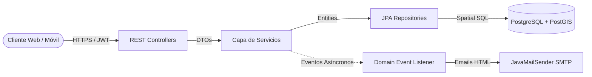
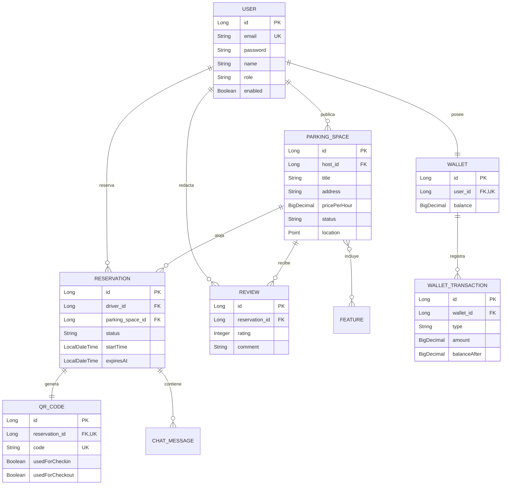

# CocheraYa — Plataforma Backend Inteligente de Estacionamiento On-Demand

---

## 1. Portada

* **Título del Proyecto:** CocheraYa — Marketplace Inteligente de Estacionamiento On-Demand en Lima Metropolitana
* **Curso:** CS 2031 Desarrollo Basado en Plataformas
* **Periodo:** 2026-2
* **Institución:** Universidad de Ingeniería y Tecnología (UTEC) — Lima, Perú
* **Integrantes:**
  * Christian Mar Carrillo (christian.mar@utec.edu.pe)
  * Luciano Rivera Valentin (luciano.rivera@utec.edu.pe)
  * Anthony Caypane Ramirez (anthony.caypane@utec.edu.pe)

---

## 2. Índice

1. [Portada](#1-portada)
2. [Índice](#2-índice)
3. [Introducción](#3-introducción)
4. [Identificación del Problema o Necesidad](#4-identificación-del-problema-o-necesidad)
5. [Descripción de la Solución](#5-descripción-de-la-solución)
6. [Modelo de Entidades](#6-modelo-de-entidades)
7. [Manejo de Errores](#7-manejo-de-errores)
8. [Medidas de Seguridad Implementadas](#8-medidas-de-seguridad-implementadas)
9. [Eventos y Asincronía](#9-eventos-y-asincronía)
10. [GitHub & Management](#10-github--management)
11. [Conclusión](#11-conclusión)
12. [Apéndices](#12-apéndices)

---

## 3. Introducción

### Contexto
El crecimiento del parque automotor en Lima Metropolitana sobrepasa la infraestructura vial. En distritos como San Isidro y Miraflores, conseguir estacionamiento seguro demanda 20 a 35 minutos de búsqueda. Esta circulación constante agrava la congestión, eleva emisiones de carbono y genera estrés ciudadano. A la par, miles de cocheras privadas residenciales permanecen desocupadas en horario laboral sin generar ningún beneficio a sus dueños.

### Objetivos del Proyecto
* **Objetivo General:** Desarrollar una API REST robusta, escalable y segura con Spring Boot 3.2 y PostgreSQL/PostGIS para optimizar el alquiler de cocheras privadas bajo demanda.
* **Objetivos Específicos:**
  1. Implementar búsqueda espacial con tipo geométrico `Point` (SRID 4326), respondiendo en menos de 50 ms para radios de 2000 metros.
  2. Asegurar consistencia transaccional con bloqueos pesimistas (`PESSIMISTIC_WRITE`) y expiración de 15 minutos mediante `@Scheduled`.
  3. Controlar acceso físico mediante códigos QR dinámicos asociados a una billetera virtual inmutable.
  4. Desplegar el sistema en la nube (AWS EC2 + RDS / Render) integrando CI/CD vía GitHub Actions.

---

## 4. Identificación del Problema o Necesidad

### Descripción del Problema
Lima sufre dos fallas simultáneas de mercado: déficit de estacionamientos formales que deriva en cobros arbitrarios e inseguridad ciudadana; y una oferta ociosa de cocheras privadas en viviendas sin una plataforma confiable para verificar usuarios, gestionar reservas y cobrar sin fricciones.

### Justificación
**CocheraYa** soluciona esta necesidad en cuatro frentes:
1. **Movilidad Urbana:** Reduce el tráfico circulante de conductores buscando aparcamiento.
2. **Medio Ambiente:** Disminuye el consumo de combustible y la huella de carbono al optimizar traslados.
3. **Economía Familiar:** Genera ingresos pasivos para propietarios al monetizar espacios desocupados.
4. **Seguridad:** Traslada vehículos vulnerables de la vía pública hacia espacios privados vigilados.

---

## 5. Descripción de la Solución

### Funcionalidades Implementadas
* **Autenticación RBAC:** Acceso basado en JWT y Refresh Tokens con roles `DRIVER`, `HOST` y `ADMIN`.
* **Geolocalización con PostGIS:** Búsqueda espacial optimizada con función `ST_DWithin` en metros reales, filtrando por distancia y precio.
* **Gestión de Reservas y Timeout:** Ciclo de vida transaccional con liberación automática tras 15 minutos de inactividad.
* **Control de Acceso con QR:** Generación de códigos QR de un solo uso para registrar check-in y check-out físico.
* **Billetera Virtual Auditada:** Liquidación de pagos por minuto con persistencia inmutable del saldo resultante (`balanceAfter`).
* **Mensajería Instantánea:** Canal de chat bidireccional entre conductor y anfitrión durante la reserva.
* **Reseñas y Calificaciones:** Calificaciones de 1 a 5 estrellas con comentarios para construir reputación comunitaria.

### Tecnologías Utilizadas
* **Backend:** Java 21, Spring Boot 3.2.5 (Spring MVC, Data JPA, Security, Mail).
* **Persistencia:** PostgreSQL 16 con PostGIS y Hibernate Spatial.
* **Seguridad:** JJWT 0.11.5 (HS256) y BCryptPasswordEncoder.
* **Mensajería y Multimedia:** Thymeleaf 3, JavaMailSender, Cloudinary SDK y Google ZXing.
* **Documentación:** SpringDoc OpenAPI 2.5.0 con Swagger UI interactivo.
* **Infraestructura:** Docker multi-stage, Docker Compose, AWS EC2, AWS RDS y GitHub Actions.

### Arquitectura del Sistema
El sistema aplica una arquitectura en capas desacoplada y orientada al dominio:


### Endpoints y Documentación Swagger
La API expone 36 endpoints versionados bajo `/api/v1/`. Documentación interactiva en `http://localhost:8080/swagger-ui/index.html`:
* **Auth (`/api/v1/auth`):** Registro de DRIVER/HOST, login JWT y renovación de tokens.
* **Cocheras (`/api/v1/parking-spaces`):** Búsqueda geoespacial por radio, CRUD para anfitriones y disponibilidad.
* **Reservas (`/api/v1/reservations`):** Creación transaccional con bloqueo pesimista, historial y cancelación.
* **Acceso Físico (`/api/v1/check-in-out`):** Validación criptográfica de QR para ingreso y salida.
* **Billetera (`/api/v1/wallets`):** Consulta de balance, transacciones auditadas, recargas y balances de anfitrión.
* **Reseñas y Chat (`/api/v1/reviews`, `/api/v1/chats`):** Calificaciones y mensajería en tiempo real.
* **Administración (`/api/v1/admin`):** Métricas globales de la plataforma bajo rol `ADMIN`.

---

## 6. Modelo de Entidades

### Diagrama de Entidades



### Descripción de Entidades y Relaciones
* **User:** Identidad de usuarios con roles segregados (`DRIVER`, `HOST`, `ADMIN`). Implementa `UserDetails`.
* **ParkingSpace:** Espacio de estacionamiento con coordenadas `Point` (SRID 4326) e índice espacial GiST. Relación `@ManyToOne` con el anfitrión y `@ManyToMany` con características bajo carga diferida `FetchType.LAZY`.
* **Reservation:** Controla el ciclo de vida (`PENDING`, `ACTIVE`, `FINISHED`, `EXPIRED`) vinculando conductor y cochera.
* **QRCode:** Token criptográfico único de acceso físico con flags independientes para entrada y salida.
* **Wallet y WalletTransaction:** Libro contable de auditoría total donde cada transacción almacena atómicamente el saldo resultante `balanceAfter`.
* **Review:** Evaluaciones numéricas restringidas entre 1 y 5 estrellas con validaciones `@Min` y `@Max`.
* **ChatMessage:** Mensajes entre conductor y anfitrión para coordinar el acceso durante la reserva.

---

## 7. Manejo de Errores

### Excepciones Globales y Códigos de Estado
La aplicación cuenta con un manejador centralizado `@RestControllerAdvice` (`GlobalExceptionHandler`) que formatea respuestas consistentes en `ErrorResponseDTO` (`timestamp`, `status`, `error`, `message`, `path`). Se cubren 9 excepciones personalizadas de negocio y excepciones de validación de Spring:

* **400 Bad Request:** Validaciones fallidas (`MethodArgumentNotValidException`), JSON incorrecto (`HttpMessageNotReadableException`), operaciones inválidas (`InvalidOperationException`, `InsufficientBalanceException`) y tokens QR vencidos o usados (`QRCodeExpiredException`, `QRCodeAlreadyUsedException`).
* **401 Unauthorized:** Tokens ausentes, expirados o credenciales erróneas (`AuthenticationException`).
* **403 Forbidden:** Intento de acceso sin privilegios suficientes o manipulación no autorizada de recursos (`UnauthorizedOperationException`, `AccessDeniedException`).
* **404 Not Found:** Entidades inexistentes en base de datos (`ResourceNotFoundException`, `EntityNotFoundException`).
* **409 Conflict:** Conflicto de disponibilidad en cocheras (`SpaceNotAvailableException`) o correos duplicados (`DuplicateResourceException`).
* **500 Internal Server Error:** Fallos no anticipados, protegidos en logs estructurados con SLF4J sin filtrar datos sensibles.

---

## 8. Medidas de Seguridad Implementadas

### Seguridad de Datos
* **Cifrado de Credenciales:** Contraseñas protegidas mediante hash irreversible con `BCryptPasswordEncoder` (costo 10).
* **Autenticación JWT:** Tokens firmados con HMAC-SHA256 desde variables de entorno (`APP_JWT_SECRET`), con claims mínimos (`userId`, `email`, `role`), expiración a 24 horas y rotación por Refresh Tokens.
* **Control de Acceso:** Verificación estricta mediante `@PreAuthorize` en endpoints sensibles y comprobación de pertenencia en servicios.

### Prevención de Vulnerabilidades
* **Inyección SQL:** Consultas JPA y JPQL parametrizadas que impiden concatenación de cadenas maliciosas.
* **Cross-Site Scripting (XSS):** Sanitización y validación estricta de entradas con Bean Validation (`@NotBlank`, `@Size`, `@Pattern`).
* **Cross-Site Request Forgery (CSRF):** Deshabilitado justificadamente al tratarse de una API REST stateless basada en cabeceras `Authorization: Bearer` sin cookies de sesión.
* **Prevención de Concurrencia:** Bloqueos pesimistas (`PESSIMISTIC_WRITE`) en transacciones financieras y reservas simultáneas.

---

## 9. Eventos y Asincronía

### Eventos del Sistema
Se aplica el patrón observador desacoplado con `ApplicationEventPublisher` y `@EventListener`:
1. **UserRegisteredEvent:** Emitido al registrar un usuario para inicializar su billetera y despachar el correo de bienvenida.
2. **ReservationCompletedEvent:** Publicado al completar el check-out para calcular la tarifa y enviar el comprobante de liquidación.
3. **ReservationExpiredEvent:** Notificado automáticamente tras 15 minutos sin check-in para liberar la cochera.

### Importancia y Justificación Asíncrona
El envío de correos y notificaciones se ejecuta en segundo plano con `@Async("taskExecutor")` sobre un `ThreadPoolTaskExecutor` (2 hilos base, 5 máximos, cola de 100). Dado que los servidores SMTP externos presentan latencias entre 300 ms y 2 segundos, aislar este procesamiento evita retener el hilo HTTP, previene cuellos de botella y garantiza respuestas inmediatas al usuario final.

---

## 10. GitHub & Management

### Gestión de Tareas y GitHub Projects
El equipo empleó metodología ágil mediante GitHub Projects con tablero Kanban (Backlog, Todo, In Progress, Done). Las funcionalidades se organizaron en Issues con etiquetas temáticas (`backend`, `security`, `bug`, `documentation`) y estimación de tiempos. La gestión de código siguió la estrategia GitFlow con ramas principales `main` (despliegue) y `develop` (desarrollo), integrando ramas por funcionalidad (`feature/*`).

### Pipeline de CI/CD con GitHub Actions
El flujo `.github/workflows/maven.yml` automatiza la integración continua. Ante cada `push` o `pull request`, aprovisiona un contenedor Docker con PostgreSQL/PostGIS, configura JDK 21, ejecuta las 48 pruebas unitarias (`mvn clean test -B`) y empaqueta el artefacto ejecutable JAR.

### Instrucciones de Instalación y Ejecución Local
Para desplegar el entorno completo en local con Docker Compose:
```bash
# 1. Clonar repositorio y preparar variables de entorno
git clone https://github.com/ChrisMar0512/cocheraya-backend.git
cd cocheraya-backend
cp .env.example .env

# 2. Iniciar base de datos PostGIS y backend
docker compose up -d --build

# 3. Acceso local
# Swagger UI: http://localhost:8080/swagger-ui/index.html
```

### Variables de Entorno Requeridas
| Variable | Descripción | Valor por Defecto |
| :--- | :--- | :--- |
| `SPRING_DATASOURCE_URL` | URL JDBC PostgreSQL con PostGIS | `jdbc:postgresql://localhost:5432/cocheraya_db` |
| `SPRING_DATASOURCE_USERNAME` | Usuario de base de datos | `cocheraya_user` |
| `SPRING_DATASOURCE_PASSWORD` | Contraseña de base de datos | `cocheraya_pass` |
| `APP_JWT_SECRET` | Clave secreta HMAC-SHA256 (256 bits) | Clave segura en `.env` |
| `APP_JWT_EXPIRATION` | Vigencia de token en milisegundos | `86400000` (24 horas) |
| `CORS_ALLOWED_ORIGINS` | Orígenes cliente autorizados | `http://localhost:3000,http://localhost:5173` |

### Enlace de Despliegue
* **Infraestructura Cloud:** La plataforma cuenta con Dockerfile multi-stage, perfiles productivos (`application-prod.properties`) y script de aprovisionamiento en AWS EC2 (`scripts/deploy-aws.sh`) y plataformas PaaS (Render / Railway).
* **URL de Acceso en Producción:** [CocheraYa API en Producción](https://cocheraya-backend.onrender.com) *(o acceso vía IP pública AWS EC2 en puerto 8080: `http://<ec2-ip>:8080/swagger-ui/index.html`)*.

---

## 11. Conclusión

### Logros del Proyecto
* Culminación exitosa de un backend empresarial para estacionamiento colaborativo en Lima, satisfaciendo la totalidad de los criterios de la rúbrica de la Semana 7.
* Integración fluida de indexación geoespacial con PostGIS, concurrencia pesimista blindada, manejo global de errores y suite de 48 pruebas unitarias aprobadas.
* Documentación interactiva en Swagger UI y colección Postman estructurada con 36 endpoints completamente documentados.

### Aprendizajes Clave
* Optimización del modelo relacional aplicando `FetchType.LAZY` para neutralizar problemas de consultas N+1.
* Ventajas de la arquitectura orientada a eventos para mantener controladores delgados y servicios desacoplados.
* Relevancia de un libro contable inmutable (`balanceAfter`) para asegurar la trazabilidad de operaciones financieras.

### Trabajo Futuro
* Incorporación de algoritmos de tarificación dinámica con Machine Learning según densidad de tráfico zonal.
* Integración de pasarelas de pago locales peruanas (Yape / Plin) mediante Webhooks seguros.
* Habilitación de reservas para puntos de carga de vehículos eléctricos.

---

## 12. Apéndices

### Licencia
Distribuido bajo licencia **MIT License**. Libre para uso educativo, comercial y modificación.

### Referencias
1. Spring Boot Reference Documentation. VMware Tanzu, 2024.
2. PostGIS Spatial Database Manual. Refractions Research, 2024.
3. RFC 7519: JSON Web Token (JWT). IETF, 2015.
4. OWASP Top 10 API Security Risks. OWASP Foundation, 2023.
